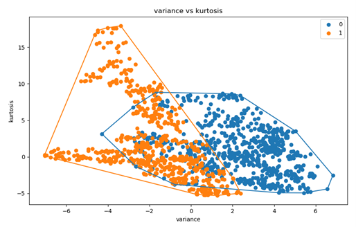

# Convex Hull Visualizer untuk Visualisasi Tes Linear Separability Dataset
> Tugas Kecil Mata Kuliah IF2211 Strategi Algoritma ITB.

## Table of Contents
* [General Info](#general-information)
* [Screenshoots](#screenshoots)
* [Technologies Used](#technologies-used)
* [Features](#features)
* [Pembagian Tugas](#pembagian-tugas)
* [Setup](#setup)
* [Usage](#usage)
* [Project Status](#project-status)
* [Room for Improvement](#room-for-improvement)
* [Acknowledgements](#acknowledgements)
* [Contact](#contact)
<!-- * [License](#license) -->


## General Information
Convex merupakan himpunan titik pada bidang planar jika sembarang dua titik pada bidang tersebut (misal p dan q), seluruh segmen garis yang berakhir di p dan q berada pada himpunan tersebut. Convex Hull dari himpunan titik S adalah himpunan _convex_ terkecil yang mengandung S. 

Program ini dapat menerima dataset lalu melakukan visualisasi Tes Linear Separability Dataset (untuk dataset yang terkategorisasi). Sedangkan, untuk dataset yang tidak terkategorisasi, maka semua titik pada dataset akan menjadi himpunan untuk satu Convex Hull.

## Screenshoots


## Technologies Used
- Python 3

## Features
- Visualisasi Tes Linear Separability Dataset
- Convex Hull Visualizer in general

## Setup
- Pastikan sudah dilakukan clone atau _download_ terhadap repository ini
- Buka folder repository ini pada terminal
- Disarankan menggunakan virtualenv, Install terlebih dahulu virtualenv dengan _command_ pada terminal:
```
pip3 install virtualenv
virtualenv src
```
- virtualenv untuk folder src akan terbuat dan untuk mengaktifkannya lakukan _command_ pada terminal:
```
src\Scripts\activate
```
- Setelah virtualenv aktif, lakukan peng-_install_-an pada modul dengan melakukan _command_ pada terminal:
```
pip3 install -r requirements.txt
```
- _Command_ tersebut akan melakukan install terhadap _library_ yang dibutuhkan untuk menjalankan program
- Jika ingin menggunakan file csv tambahan silahkan tambahkan file csv tersebut ke folder test

## Usage
- Pastikan sudah dilakukan clone atau _download_ terhadap repository ini
- Buka folder repository ini pada terminal
- Aktifkan virtualenv dan jalankan program yang sudah dibuat dengan cara lakukan _command_ pada terminal:
```
src\Scripts\activate
python src\main.py
```
- Program akan berjalan dan silahkan masukkan input sesuai yang diminta oleh program
- Setelah selesai menggunakan program, matikan virtualenv dengan _command_ pada terminal:
```
deactivate
```


## Project Status
Project ini sudah  _selesai_ 

## Room for Improvement
Room for improvement:
- Sebagian dari source code yang ditulis itu _redundant_, sehingga bisa dilakukan pengecekan dan penghapusan terhadap beberapa code
- Projek ini terbatas deadline, sehingga code secara keseluruhan agak berantakan dan dapat dikembangkan lebih rapih lagi

## Acknowledgements
- Projek ini dikerjakan untuk memenuhi tugas kecil mata kuliah IF2211 Strategi Algoritma
- Terima kasih kepada seluruh dosen pengajar dan asisten mata kuliah IF2211 Strategi Algoritma

## Contact
Created by:
- [@apwic](https://github.com/apwic)
<!-- Optional -->
<!-- ## License -->
<!-- This project is open source and available under the [... License](). -->

<!-- You don't have to include all sections - just the one's relevant to your project -->
